# jenkins 自动化部署

## 环境

- windows/mac 本地开发环境
- github/xxx
- jenkins 测试服务器
- server 线上服务器

## 流程

    本机开发完成 → 测试成功 push -> github(触发webhook) -> jenkins(hook自动拉取/手动拉取) ↓
    测试成功 -> 发送邮件 -> 自动提交至线上服务器
    测试失败 -> 发送邮件

## 配置

1.  建立 github 仓库 拉取至本地初始化 写代码 ...
2.  测试服务器安装 java jdk/jenkins 并启动
3.  登录 jenkins 配置插件

    - Jenkins Location
      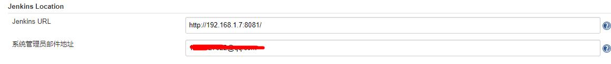
    - github server
      [配置与添加 webhook](https://blog.csdn.net/qq_21768483/article/details/80177920)
      webhook 测试服务器必须是公网 ip，本地可使用 [ngrok](https://www.jianshu.com/p/4f23a100ca6b)

    - Extended E-mail Notification 邮件通知
      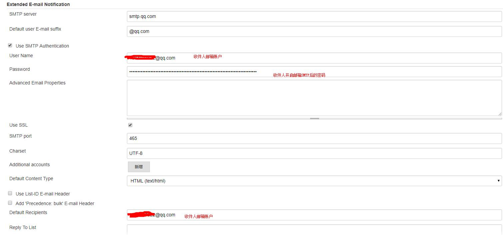
      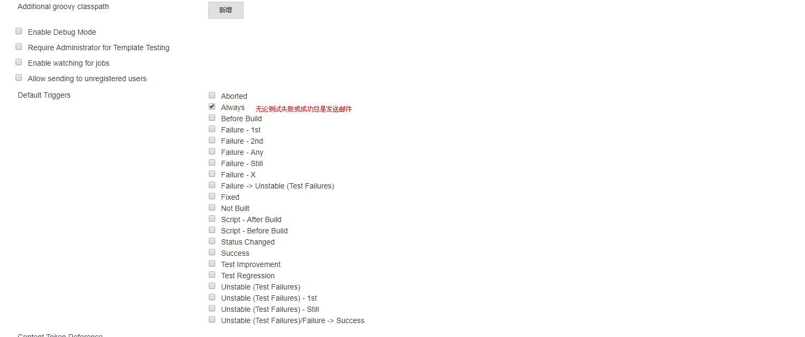
      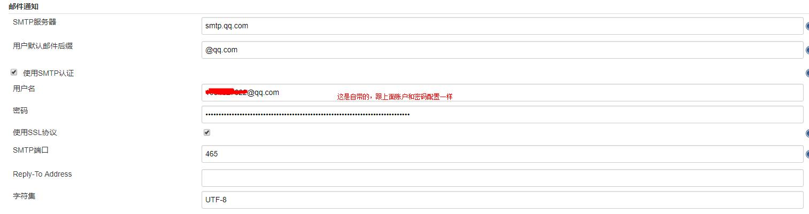
    - Publish over SSH 提交至测试服务器
      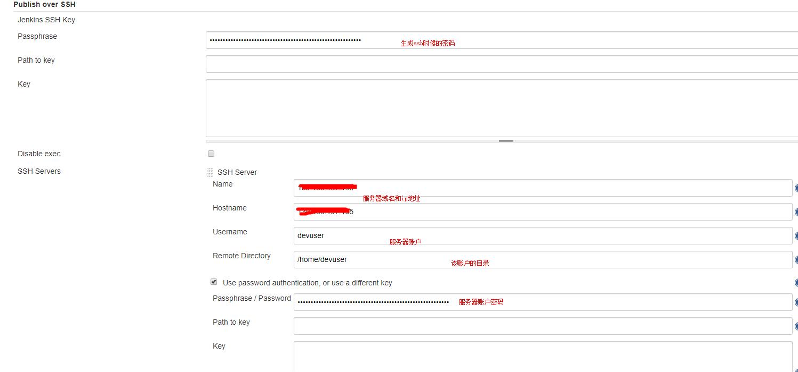
      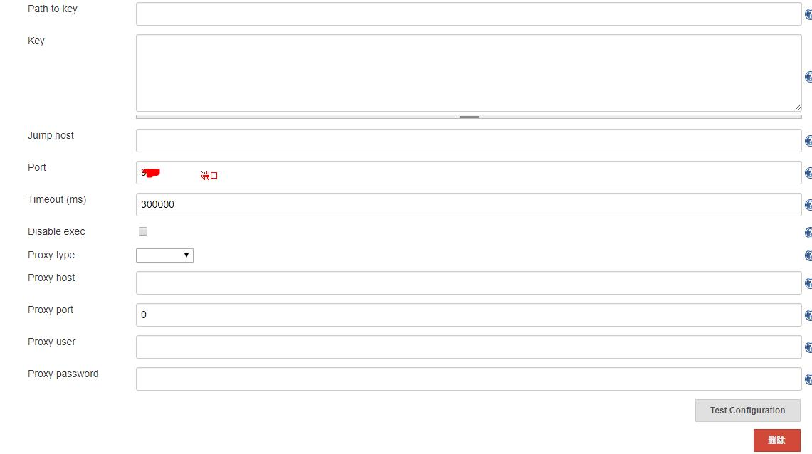
    - 配置 ssh 需要测试服务器免密登录线上服务器

      测试服务器 jenkins .ssh 配置权限 700 生成成秘钥

            ssh-keygen -t rsa -b 2048
      git 配置 ssh
      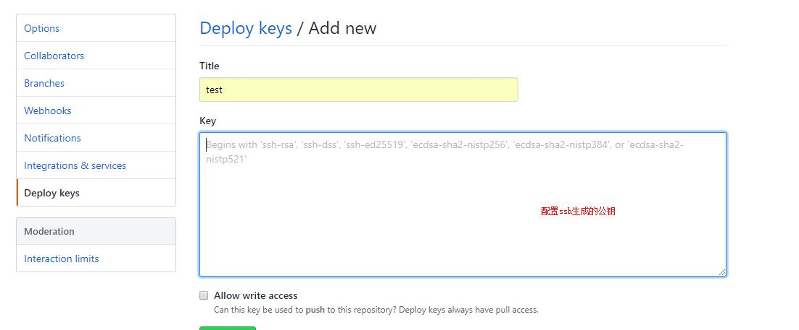

      拷贝公钥到线上服务器（需要输入该用户登录密码）

            ssh-copy-id -i ./id_rsa.pub  服务器用户名@192.168.x.xxx

      线上服务器 修改 /etc/ssh/sshd_config 配置

            RSAAuthentication yes
            PubkeyAuthentication yes
            PasswordAuthentication no

      测试免密登录

    - jenkins 构建配置

      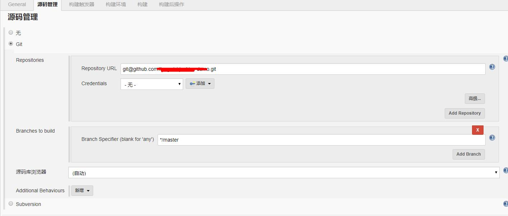
      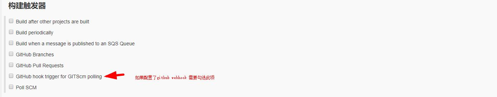
      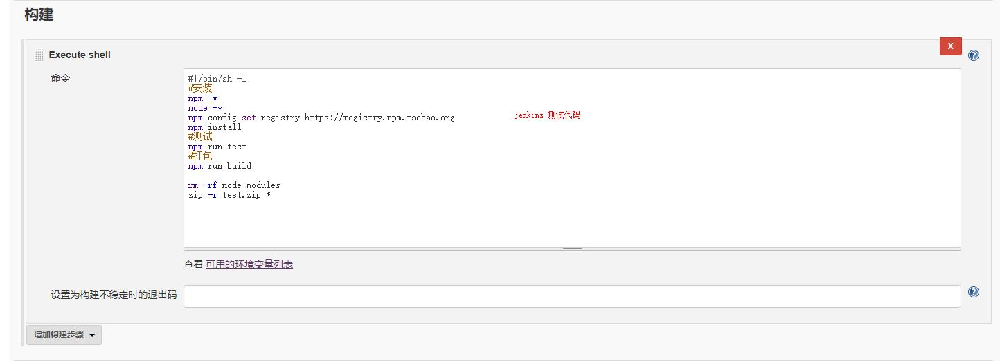
      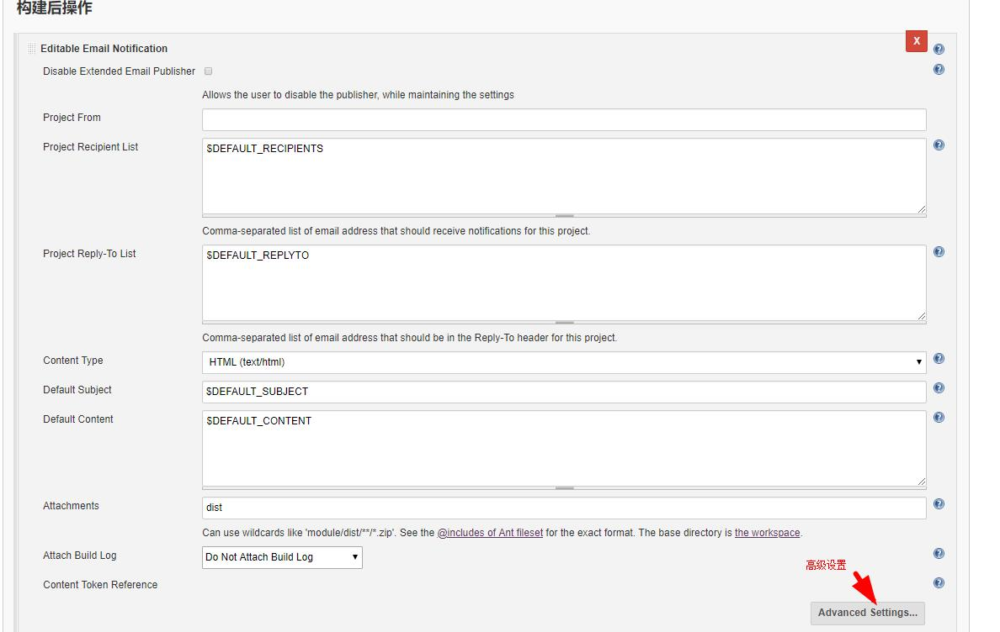
      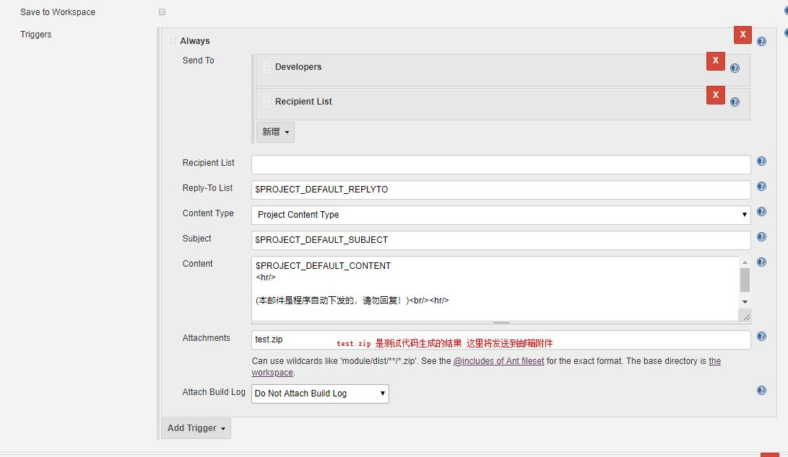
      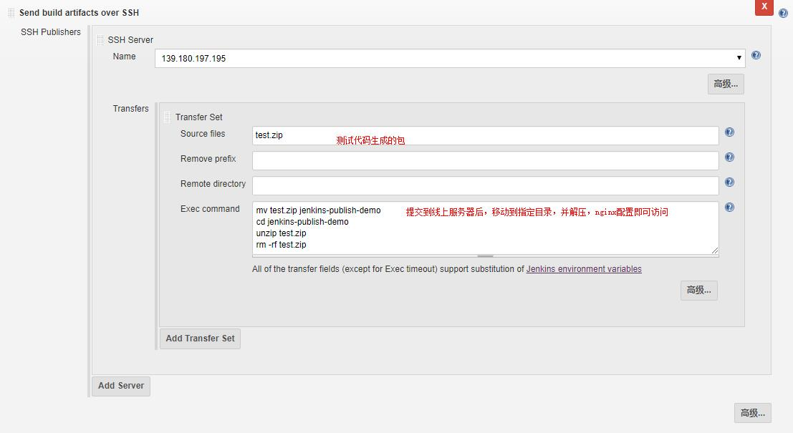
